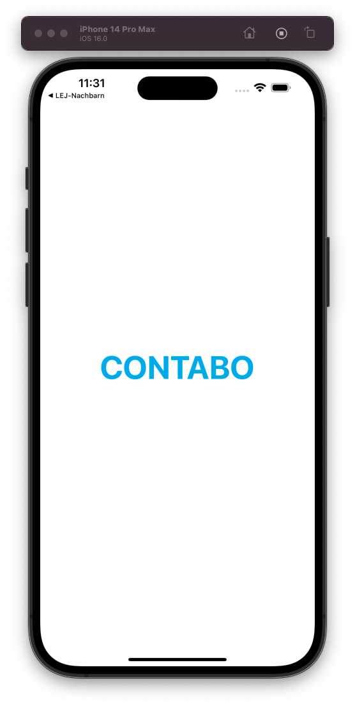

# My Contabo App

Contabo ist ein Hoster aus Deutschland. Unter https://my.contabo.com bieten sie ihren Kunden ein Webinterface an, bei der die Kunden ihre Server imd weiteren Dienste verwalten können. Ich mich entschieden, eine App zu schreiben, welche die wichtigsten Funktionen von Contabo bereitstellt und und damit die Zugänglichkeit vereinfacht. Die App ist mit React Native auf Expo geschrieben und läuft auf Android, iOS sowie als Web-App.

Ich bin kein Mitarbeiter von Contabo. Ich bin Kunde und habe die App für mich geschrieben, um jederzeit über den Status meiner Server informiert zu sein.

## Features

Im ersten Release sind folgende Features enthalten:

- Server starten, stoppen, neustarten
- Den Status der Server anzeigen
- Notifications bei Serverstart, -stop und -neustart
- Notifications bei Serverausfällen
- Logfiles anzeigen

## Installation

Die App ist im Play Store und App Store verfügbar. Die App ist kostenlos und ohne Werbung.

## Screenshots

## Lizenz

Die App ist unter der CC BY-NC-SA 4.0 Lizenz veröffentlicht. Siehe [LIZENS](https://creativecommons.org/licenses/by-nc-sa/4.0/) für mehr Informationen.

## Kontakt

Bei Fragen oder Problemen könnt ihr mich gerne kontaktieren. Ich bin über folgende Kanäle erreichbar:

- [Twitter](https://twitter.com/vergissberlin)

## Contributing

Pull requests sind willkommen. Für größere Änderungen, erstellt bitte zuerst ein Issue, damit wir uns darüber unterhalten können.

Um Dir einen Überblick über die Struktur der App zu verschaffen, empfehle ich Dir [CONTRIBUTING.md](CONTRIBUTING.md) zu lesen.
